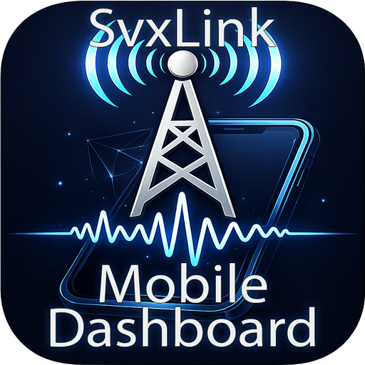

# 📡 SVXLink Mobile Dashboard Ver 1.0 

This extension builds on [SVXLink-Dash-V2 by DL3EL](https://github.com/DL3EL/SVXLink-Dash-V2) and brings the full desktop dashboard in a clean, smartphone-optimized version.

This is an dual language Dashboard --> German and English! you install it and you can use both versions.
> 🇬🇧 **An English version of this dashboard is available at `/mobile/en`**

<p align="center">
  
  
  
  
</p>

-----

## ✨ Features

- 📊 **Live Dashboard** — Radio status, active TGs, current speaker
- 📱 Installable as a PWA — Fullscreen just like in the screenshots
- 📋 **Activity Log** — SVXReflector activity in real time
- 🔁 **Talk Groups** — View and activate TGs directly
- ⌨️ **DTMF Keypad** — Send DTMF tones with a single tap
- ⚡ **Quick Commands** — Configurable shortcut buttons (from `config.php`)
- 🌙☀️ **Automatic Dark/Light Mode** — Follows the system appearance of your phone

-----

## 📲 Installation

> Requires a working [SVXLink-Dash-V2](https://github.com/DL3EL/SVXLink-Dash-V2) installation under `/var/www/html`.

Run from the home directory on the SVX server / Pi:

```bash
cd /var/www/html && sudo git clone --depth 1 https://github.com/sebastianmadl/svxlink-mobiledash.git temp && sudo mv temp/mobile mobile && sudo rm -rf temp && sudo chown -R www-data:www-data mobile
```

Then open in your browser for German:

```
http://<IP-of-SvxHost>/mobile/
```

Then open in your browser for English:

```
http://<IP-of-SvxHost>/mobile/en
```

-----

## 📁 Directory Structure

```
/var/www/html/
└── mobile/
    ├── index.php          # Main SPA – German version
    ├── dtmf.php           # Standalone DTMF page – German version
    ├── manifest.json      # PWA manifest – German
    ├── css/
    │   └── app.css        # Shared styles incl. Dark/Light Mode
    ├── js/
    │   └── app.js         # Frontend logic – German strings & api/ paths
    ├── api/
    │   ├── dtmf.php       # DTMF API endpoint (shared)
    │   └── stream.php     # SSE live data stream (shared)
    ├── images/            # Shared icons
    │   ├── icon-192.png
    │   └── icon-512.png
    └── en/
        ├── index.php      # Main SPA – English version  →  mobile/en/
        ├── dtmf.php       # Standalone DTMF page – English version
        ├── manifest.json  # PWA manifest – English
        └── app.js         # Frontend logic – English strings & ../api/ paths
```

-----

## 🖌️ Dark / Light Mode

The dashboard automatically adapts to the system appearance of your phone — no manual toggle needed. Simply switch between Dark and Light Mode in your smartphone's display settings.

<p align="center">
  
  
</p>

-----

## 📱 Install as App (PWA)

The dashboard can be installed on your home screen and will behave like a native app — no browser bar, full screen.

**App icon:**


**iOS (Safari):**
1. Open the page in Safari
2. Tap the share icon (⬆️)
3. Select "Add to Home Screen"
4. Confirm the name → "Add"

**Android (Chrome):**
1. Open the page in Chrome
2. Tap the menu (⋮)
3. Select "Add to Home Screen"
4. Confirm the name → "Add"

> Tip: On iOS, Safari must be used. On Android, Firefox or Edge also work.

-----

## 👤 Author

**OE1SXM — Sebastian M.**  
[github.com/sebastianmadl](https://github.com/sebastianmadl)

-----

## 🙏 Credits

- Original Dashboard: [DL3EL/SVXLink-Dash-V2](https://github.com/DL3EL/SVXLink-Dash-V2)
- SVXLink Project: [sm0svx/svxlink](https://github.com/sm0svx/svxlink)

-----

## 📄 License

This project builds on SVXLink-Dash-V2. Please refer to the original project for license details.
