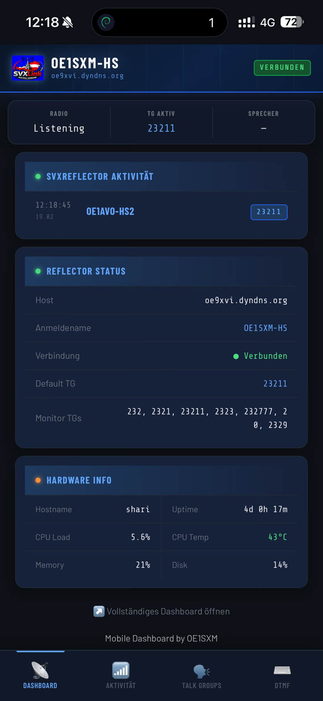

# 📡 SVXLink Mobile Dashboard

Ein responsives, mobil-optimiertes Web-Dashboard für [SVXLink](https://github.com/sm0svx/svxlink) / SVXReflector — direkt im Smartphone-Browser nutzbar.

Aufgebaut auf Basis von [SVXLink-Dash-V2 von DL3EL](https://github.com/DL3EL/SVXLink-Dash-V2).



-----

## ✨ Funktionen

- 📊 **Live Dashboard** — Radiostatus, aktive TG, aktueller Sprecher
- 📋 **Aktivitätslog** — SVXReflector-Aktivität in Echtzeit
- 🔁 **Talk Groups** — TGs direkt anzeigen und aktivieren
- ⌨️ **DTMF-Tastatur** — DTMF-Töne mit einem Tipp senden
- ⚡ **Schnellbefehle** — Konfigurierbare Shortcut-Buttons (aus `config.php`)
- 🌙☀️ **Automatischer Dark/Light Mode** — Folgt der Systemdarstellung des Handys

-----

## 📲 Installation

> Setzt eine funktionierende [SVXLink-Dash-V2](https://github.com/DL3EL/SVXLink-Dash-V2) Installation unter `/var/www/html` voraus.

Vom Home-Verzeichnis auf dem Raspberry Pi ausführen:

```bash
wget https://github.com/sebastianmadl/svxlink-mobiledash/releases/latest/download/svxlink-mobiledash.zip
sudo unzip -o svxlink-mobiledash.zip -d /var/www/html
```

Danach im Browser aufrufen:

```
http://<IP-des-Pi>/mobile/
```

-----

## 📁 Verzeichnisstruktur

```
/var/www/html/
└── mobile/
    ├── index.php          # Haupt-SPA (Dashboard, Aktivität, TG, DTMF)
    ├── dtmf.php           # Eigenständige DTMF-Seite
    ├── api/
    │   ├── dtmf.php       # DTMF-API-Endpunkt
    │   └── stream.php     # SSE Live-Datenstrom
    ├── css/
    │   └── app.css        # Styles inkl. Dark/Light Mode
    └── js/
        └── app.js         # Frontend-Logik
```

-----

## ⚙️ Voraussetzungen

- SVXLink-Dash-V2 installiert und funktionsfähig unter `/var/www/html`
- Apache läuft als Benutzer `svxlink` (erforderlich damit DTMF funktioniert!)
- PHP 7.4+

> **Wichtig:** Der Webserver muss als Benutzer `svxlink` laufen, sonst werden DTMF-Befehle nicht an den Repeater-Controller weitergeleitet.

-----

## 🖌️ Dark / Light Mode

Das Dashboard passt sich automatisch an die Systemdarstellung des Handys an — kein manueller Schalter nötig. Einfach in den Display-Einstellungen des Smartphones zwischen Dark und Light Mode wechseln.

-----

## 👤 Autor

**OE1SXM — Sebastian M.**  
[github.com/sebastianmadl](https://github.com/sebastianmadl)

-----

## 🙏 Danksagung

- Ursprüngliches Dashboard: [DL3EL/SVXLink-Dash-V2](https://github.com/DL3EL/SVXLink-Dash-V2)
- SVXLink Projekt: [sm0svx/svxlink](https://github.com/sm0svx/svxlink)

-----

## 📄 Lizenz

Dieses Projekt baut auf SVXLink-Dash-V2 auf. Lizenzdetails bitte beim Originalprojekt nachlesen.
